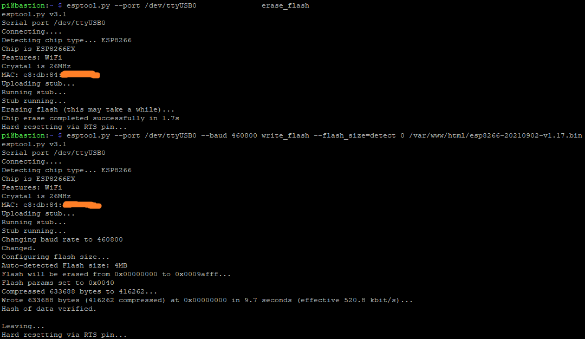
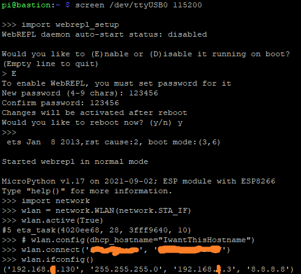

## pyWebREPL
* The libarary will enable remote control of ESP8266 dev board. 
* One can push MicroPython code to a ESP8266 wirelessly and run it in a real time manner.
</img>
## Mechanism
* An ESP8266 dev board will be flashed with MicroPython firmware
* Enable the board's WebREPL feature so one can get MicroPython prompt via a webservice
* Join the board to a router (wireless local area network)
* At this moment, there is only a broswer client to talk to the webservice 
* This library provide a Python client to talk to the webservice
## More Deeper
* The webservice uses the websocket protocol 
* This Python library converts your MicroPython code into websocket frames
* Frames are sent to the webservice then MicroPython code will be executed in real time.
## Material List
* ESP8266 dev board
* Raspberry Pi 
* WiFi router (Pi is already connected to this router)
## ESP8266 blink test with above materials
* Hook ESP8266 up with Raspberry Pi so ESP8266 appears at /dev/ttyUSB0
* Install ESPtool
```
pip install esptool
```
* Flash EPS8266 with MicroPython Firmware [esp8266-20210902-v1.17.bin](https://micropython.org/download/esp8266/)
```
esptool.py --port /dev/ttyUSB0               erase_flash
esptool.py --port /dev/ttyUSB0 --baud 460800 write_flash --flash_size=detect 0 /var/www/html/esp8266-20210902-v1.17.bin
screen /dev/ttyUSB0 115200
```
</img>
* Enable WebREPL and Join ESPtool to WiFi router
```
import webrepl_setup 
import network 
wlan = network.WLAN(network.STA_IF)
wlan.active(True)
# wlan.config(dhcp_hostname="IwantThisHostname") 
wlan.connect('xxx', 'xxxxxx')
wlan.ifconfig()
```
</img>
* Run this [Python code](misc/pyWebREPL_blink.ipynb) on Raspberry Pi to blink ESP8266 
