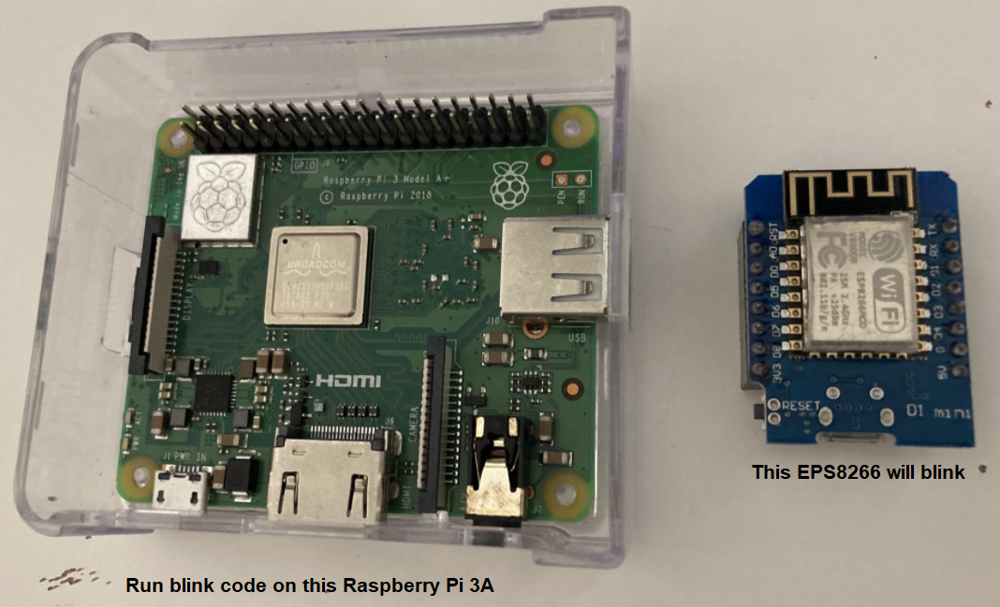

## Intro
* I wanted to program my ESP8266 over the Wireless LAN in real time so I created this library.
## pyWebREPL 
* [micropython/webrepl](https://micropython.org/webrepl/) provides a browser-based client to control ESP32/ESP8266 but it is not for real automation.
* I did a [reverse-engineering work](https://github.com/xg590/tutorials/blob/b3891f3025b8f4d7846b6010a1a85c120744e281/Web_dev/flask/websocket/README.md) with the help of Wireshark and Chrome Devtools.  
</img>
## Know problem
As of 24 Nov 2022, the network config of ESP32 is not persistent (it loses WIFI connection after power-off), esp8266 is OK. A workaround is putting the following code in the main.py. I will automate this procedure in the future. 
```
import network                         
wlan = network.WLAN(network.STA_IF)    
wlan.active(True)                       
wlan.connect(SSID, WIFI_PASSWD)   
``` 
## Material List
* ESP32/ESP8266 dev board
* Raspberry Pi (OR any Linux)
* WiFi router (Pi is already connected to this router)
## Follow this section and skip others if you only want blink ESP32/ESP8266 over the WiFi.
* For one time, a USB cable is still necessary to connect ESP32/ESP8266 to the Raspberry Pi. 
* Run following commands on Raspberry Pi.
```
sudo apt update && sudo apt install python3 python3-pip
pip install esptool
git clone -b v1.2 https://github.com/xg590/pyWebREPL.git
cd pyWebREPL
wget https://micropython.org/resources/firmware/esp8266-20220618-v1.19.1.bin && wget https://micropython.org/resources/firmware/esp32-20220618-v1.19.1.bin
bash misc/flash_adv.sh --model esp8266 --port /dev/ttyUSB0 --bin esp8266-20220618-v1.19.1.bin --hostname myESP8266 --webrepl-passwd 123456 --ssid xxx --wifi-passwd xxx
bash misc/flash_adv.sh --model esp32   --port /dev/ttyUSB0 --bin   esp32-20220618-v1.19.1.bin --hostname myESP32   --webrepl-passwd 123456 --ssid xxx --wifi-passwd xxx
tail -n4 flash.log
```
* The last tail command reveals what IP is given by a WiFi router to the ESP32/ESP8266 board.
* After run these commands, ESP32/ESP8266 can be detached from Raspberry Pi and powered by a separate USB charger. 
* Blink ESP32/ESP8266 with pyWebREPL over the WiFi.
```
python3 example/blink.py 192.168.x.xxx 
``` 
## Mechanism
* Flash the ESP32/ES8266 dev board with MicroPython firmware then one can get a MicroPython prompt for the ESP32/ESP8266.
* Enable MicroPython's WebREPL feature and join ESP32/ESP8266 to a WiFi network so that the prompt can be accessed as a webservice.
* Before pyWebREPL, there is a [broswer client](https://micropython.org/webrepl/) for us to talk to the webservice.
* This library provide a Python client for Raspberry Pi to talk to the webservice.
## More Deeper
* The webservice uses the [websocket](https://www.rfc-editor.org/rfc/rfc6455.html#section-5.2) protocol 
* This Python library for Raspberry Pi converts the MicroPython code into websocket frames
* Frames are sent to the webservice then MicroPython code will be interpreted on ESP32/ESP8266 in real time.
## A few words about MicroPython prompt (Nonprinting Characters)
* In the MicroPython prompt, when we press <kbd>ctrl</kbd>+<kbd>e</kbd> (its caret notation is <kbd>^E</kbd>) on keyboard, we activate the paste mode. 
* If we refers to <i>Control code chart</i> of [ASCII](https://en.wikipedia.org/wiki/ASCII), we know <kbd>^E</kbd> is <kbd>"\x05"</kbd>, so we can activate the paste mode when we send b"\x05" via webREPL. Then our code will be received in paste mode, which is how we run code block.
## Update log
* New for v1.2 [see example](misc/update_v1.2.ipynb)
  * Add two new functions: write_main and soft_boot.
  * main.py is executed automatically after the boot of MicroPython interpreter. write_main create or update the main.py in root directory.
